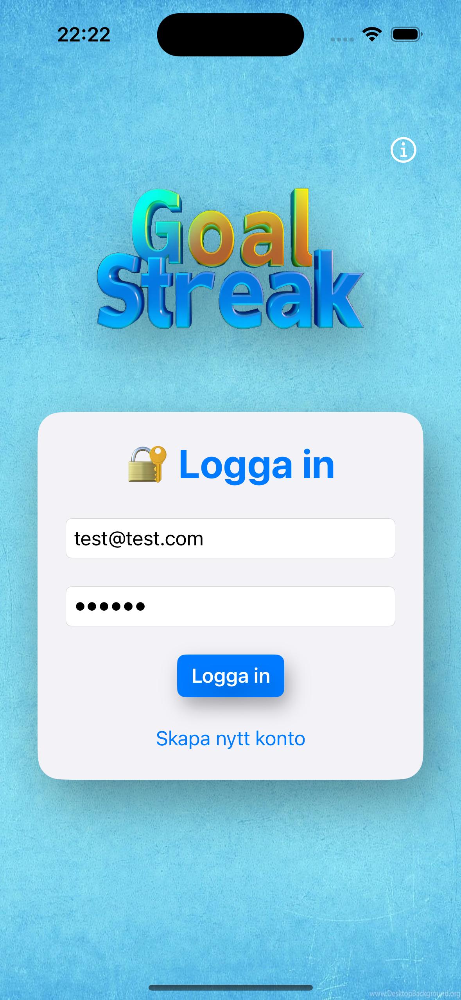
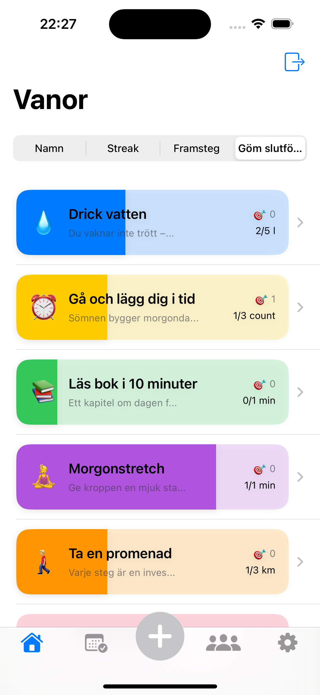
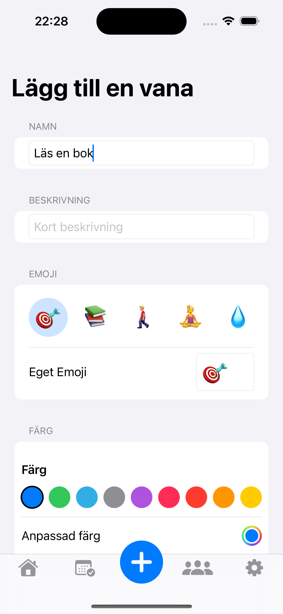
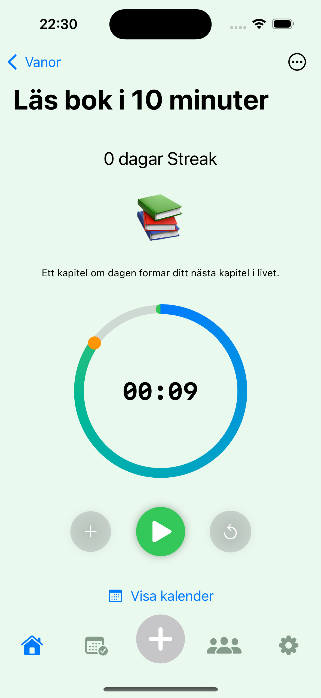
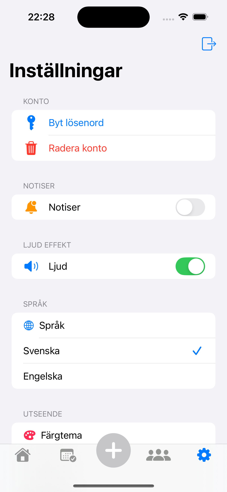

# 🏆 GoalStreak

**GoalStreak** is a habit and goal-tracking app built with **SwiftUI** and **Firebase**.
It helps users build positive routines, track their progress, and stay motivated through visual feedback, streaks, and reminders.

---

## ✨ Purpose

GoalStreak is designed to help users:
- Track habits and personal goals effortlessly.
- Visualize daily, weekly, and monthly progress.
- Build motivation through rewards and feedback.
- Develop consistency by celebrating small wins.

---

## 🔐 Core Features

### 🔸 Authentication
- Firebase Authentication (email & password)
- Sign up, login, logout
- Password reset & account deletion
- Real-time auth state listener

### 🔸 Goal Management
- **CRUD operations**: create, read, update, delete goals
- Real-time updates with Firestore snapshot listeners
- Track streaks, progress, and goal completion
- Store and view activity logs
- Weekly statistics visualization

### 🔸 UI & Interaction
- Tab-based navigation: **Home**, **Stats**, **New Goal**, **Group**, **Settings**
- Haptic and sound feedback
- Dark, light, or system appearance
- Local notifications for reminders

---

## ⏱ Timer & Progress Tracking
- For time-based goals (e.g., “Meditate for 10 minutes”)
- Start / Pause / Reset with circular progress animation
- Saves state locally via `UserDefaults`
- Syncs with Firestore when paused or completed
- Shows 🎉 animation upon completion

---

## 📊 Statistics & Calendar
- **StatsView** displays weekly charts
- **CalendarView** provides a monthly overview of completed goals
- Color-coded progress rings for motivation

---

## 🔔 Feedback & Notifications
- Centralized sound manager (`SoundPlayer`)
- Optional sounds toggle in Settings
- Local notifications with permission handling

---

## 🌍 Localization
- Supports both **Swedish** and **English**
- Managed by `LocalizationManager`
- Strings handled via `Localizable.strings` in `.lproj` folders

---

## ⚙️ Dependencies
- **Firebase Auth** — user authentication
- **Firebase Firestore** — cloud storage and real-time sync
- **SwiftUI** — modern UI framework
- **Combine** — reactive state management
- **UserNotifications** — local notifications

---

## 🚀 Future Improvements
- Offline mode with local caching
- Per-goal notification scheduling
- Shared/group goals with social view
- Extended analytics and goal categories
- Additional themes and icons
- Two-factor authentication

---

## Developer Notes
- Uses MVVM architecture with clear separation of logic and UI.
- `Goal` model integrates with Firestore using `@DocumentID` and `Codable`.
- Real-time synchronization ensures live UI updates.
- Timezone comparisons should use UTC for streak accuracy.
- Timer state is stored locally to prevent sync conflicts across devices.

---

## 📸 Screenshots

Here are some preview images of GoalStreak in action:

  
  
  
  
  

